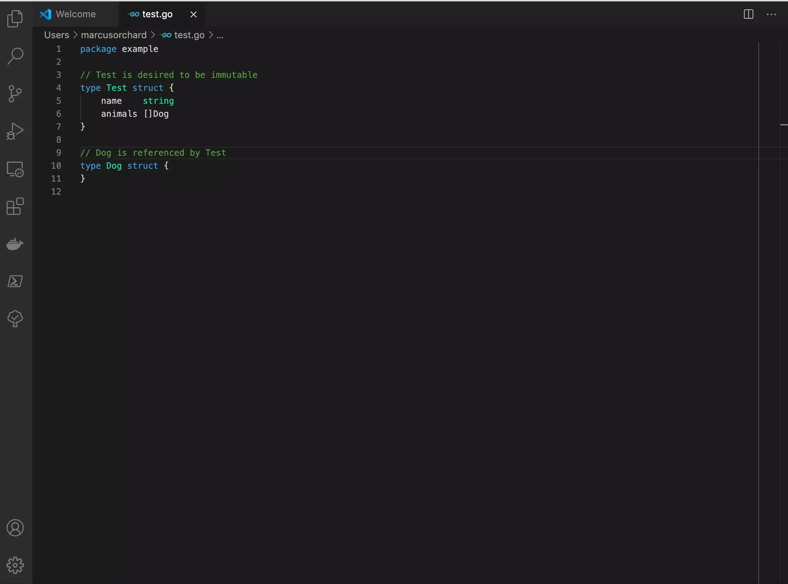

# go-immutable

The goal of this extension is to aid building immutable data structures in Golang (Go)

## Features
Generates Get and With methods for immutable go data structures

## Release Notes

### 0.0.1 - 0.0.2

Initial release adds support for get and with methods

